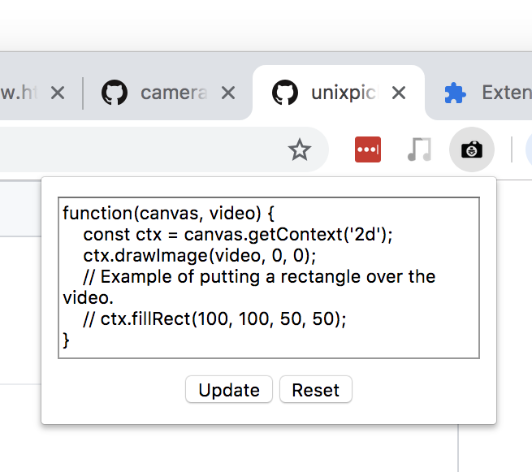

# camera-hijack

This is a chrome extension that allows you to manipulate the images that webpages read from your webcam. Notably, you can use it to manipulate your camera feed on video chats. The extension gives you as much freedom as possible, by letting you provide a piece of JS code that draws each frame.



# Installation

 * Go to `chrome://extensions`.
 * Enable developer mode (should be a switch in the top-right corner).
 * Click `Load Unpacked`
 * Select the `plugin` directory in this repository.
 * This should add a button for the extension to the menu bar.

# Examples

Identity function:

```js
function(canvas, video) {
    const ctx = canvas.getContext('2d');
    ctx.drawImage(video, 0, 0);
}
```

Make the camera spin around like crazy:

```js
function(canvas, video) {
    window.HACKS_ANGLE = ((window.HACKS_ANGLE || 0) + 0.1) % (Math.PI * 2);
    const ctx = canvas.getContext('2d');
    ctx.save();
    ctx.translate(canvas.width / 2, canvas.height / 2);
    ctx.rotate(window.HACKS_ANGLE);
    ctx.drawImage(video, -canvas.width / 2, -canvas.height / 2);
    ctx.restore();
}
```

Replace your video with a smiley face whose mouth moves along with your audio level:

```js
function(canvas, video) {
    function setupAudioLevel() {
        window.HACK_VOLUME_LEVEL = 0.0;
        navigator.mediaDevices.getUserMedia({ audio: true, video: false }).then((stream) => {
            const ctx = new AudioContext();
            const source = ctx.createMediaStreamSource(stream);
            const node = ctx.createScriptProcessor(4096, 1, 1);
            node.onaudioprocess = (event) => {
                const buffer = event.inputBuffer.getChannelData(0);
                let sum = 0;
                for (let i = 0; i < buffer.length; ++i) {
                    sum += Math.abs(buffer[i]);
                }
                window.HACK_VOLUME_LEVEL = sum / buffer.length;
            };
            source.connect(node);
            node.connect(ctx.destination);
        });
    }

    if ('undefined' === typeof window.HACK_VOLUME_LEVEL) {
        setupAudioLevel();
        window.HACK_ROLLING_MAX = [];
    }

    window.HACK_ROLLING_MAX.push(window.HACK_VOLUME_LEVEL);
    while (window.HACK_ROLLING_MAX.length > 100) {
        window.HACK_ROLLING_MAX.shift();
    }
    const maxVolume = window.HACK_ROLLING_MAX.reduce((a, b) => Math.max(a, b), 0.001);

    const ctx = canvas.getContext('2d');
    ctx.clearRect(0, 0, canvas.width, canvas.height);

    const scale = Math.min(canvas.width, canvas.height);
    const cx = canvas.width / 2;
    const cy = canvas.height / 2;

    ctx.lineWidth = scale / 50;
    ctx.strokeStyle = 'yellow';
    ctx.fillStyle = 'yellow';

    // Face
    ctx.beginPath();
    ctx.arc(cx, cy, scale * 0.4, 0, Math.PI * 2);
    ctx.stroke();

    // Eyes
    ctx.beginPath();
    ctx.arc(cx - scale * 0.15, cy - scale * 0.1, scale * 0.1, 0, Math.PI * 2);
    ctx.stroke();
    ctx.beginPath();
    ctx.arc(cx + scale * 0.15, cy - scale * 0.1, scale * 0.1, 0, Math.PI * 2);
    ctx.stroke();

    // Mouth
    const mouthHeight = scale * 0.1 * (0.5 + window.HACK_VOLUME_LEVEL / maxVolume);
    ctx.fillRect(cx - scale * 0.1, cy + scale * 0.15 - mouthHeight / 2, scale * 0.2, mouthHeight);
}
```
